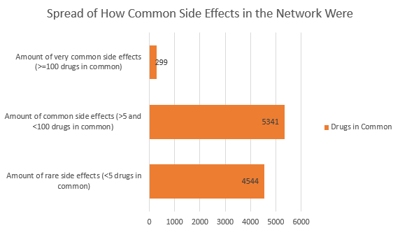
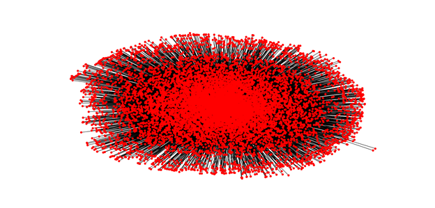
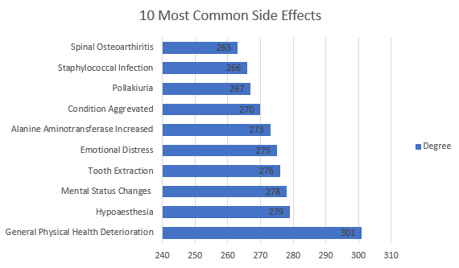
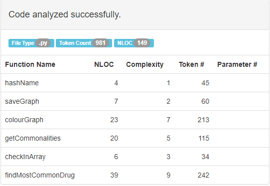
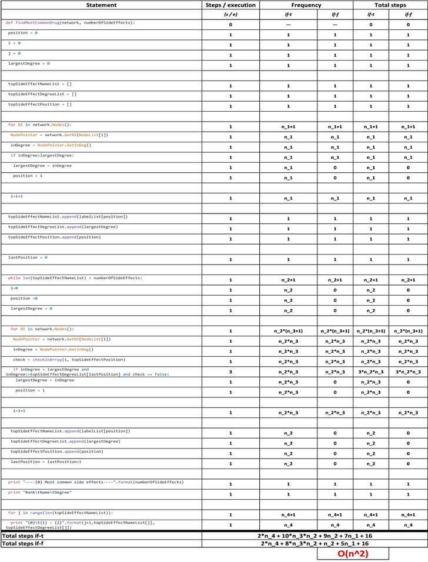

# Decagon

The project was conducted by: James Robb, Velian Velikov, Harry Finch, Daniel Denley

The dataset used in this AI project: [Stanford Network Analysis Platform (SNAP) - Decagon](http://snap.stanford.edu/decagon/). Decagon is a graph convolutional neural network for multirelational link prediction in heterogeneous graphs.

Word Count: **1428**

## Describing the problem:
When treating one or more medical conditions within a patient it is commonplace for them to be prescribed more than one drug for treatment, referred to as polypharmacy. Combinations of drugs are known to create unique side effects and/or increase the frequency of particular side effects manifesting. We aim to create a solution to this problem by finding the common side effects for drug combinations to help the patient understand the risk factors of taking drug combinations and the possible side effects they could experience. We are aiming to produce a program that can produce a graph containing the drugs the patient is taking, the graph will also highlight the ‘at risk’ symptoms (the common side effects), and this will help give everyone involved with the patients treatment a better idea as to what they can expect to happen from the process.
## Dataset and their graph properties:
The data set that was used was the ChSe Decagon data set. The data contained inside of this data set was extracted "from public documents, package inserts, drug labels, off-label associations between drugs and side effects, and adverse event reporting systems that collect reports from doctors, patients and drug companies.”
This data set consists of STITCH numbers, an industry-wide ID for drug names, Side effect IDs, and Side effect names.
The data set is made up of 10,825 nodes and 174,978 edges, with something different about this dataset being that it contains two different types of nodes, drug nodes and side effect nodes. There are 640 drug nodes and 10185 side effect nodes. This presented a challenge at first as we were unsure how it was going to be possible to tell the nodes apart. However, the edges indicate that a drug has the side effect the edge is connected to, so by working out the in degree of a node it was possible to determine whether it was a drug node if the in degree was 0 and a side effect node if the in degree was greater than 0.
## Approach to solving the problem:
The information we wanted to obtain was as follows; the most common side effects, the different communities within the network, the most common side effects of different drug combinations, and seeing the overall spread of how common side effects are. To solve these problems we used the snap framework for python. We chose python as we had more experience programming in python instead of c++. The first step was converting the data from a csv into a network that we could use. This was done by reading in the csv file and adding nodes to the network, try and except were used to do this as if a node was added with an id that was already in the network it would throw an exception. This made it relatively easy to do. 

The second thing that we did was generate a graph of the network. We soon realised that generating a graph of the full network with graphviz was going to be impossible due to how long it would take to render so to render the full network we used Networkx and Matplotlib, a disadvantage of this, however, was that we lost a lot of valuable information that was presented to the user. To compensate for this we then rendered smaller graphs with graphviz that made the structure of the network clear and easy to understand. To add colour to these graphs we wrote a function which edited the dot files produced by graphviz to give a node a colour depending on its In Degree.
After generating the graph we then worked on finding the most common side effect. This was done by going through all the nodes in the network provided and finding the node with the largest in degree. A function was then made using the process which found the top 10, or a number the user specifies, most common side effect nodes. A similar process was also used to determine the overall spread of how common side effects were by adding to a counter depending on the in degree of a node.

Finally, an edge list was created from the network and then an example snap program for communities was run on this edge list to determine how many different communities were contained within the network. 
## Results obtained and their interpretation:
From our results, we were able to extrapolate the spread on how common side effects within the network were and the most common side effects, which we then presented as charts within our presentation.
The spread of common side effects showed us that the frequency of very common side effects within the network (presented in 100 or more drugs) was much less common than common or rare side effects. Only 299 very common side effects were discovered compared to 5341 common side effects (presented in 5 to 100 drugs) and 4544 rare side effects (presented in less than 5 drugs). **(Figure 1)**
From our data set, we also created a graph displaying the most common side effects presented by the drugs. From this, we could conclude that the side effect ‘General physical deterioration’ was the most common side effect presented in the drugs by a fairly large degree compared to the other common side effects. **(Figure 2)**
Finally, it was also discovered that the network contained 6 different communities. This means that there are 6 groups of drugs that have common side effects inside the communities, but then share no common effects with any of the other drugs. This is interesting as you’d expect most drugs to have very similar side effects. This can be explained by different types of drugs aimed at different conditions, mainly the more severe drugs such as cancer treatments that won’t share common side effects with ‘softer’ drugs like paracetamol or ibuprofen for example.
## Possible future enhancements:
Although our program was successful in achieving our goals there is still room for possible future enhancements. Firstly the fact that all the side effects listed are incredibly specific and some seem as though they’re redundant or unusual effects the integrity of the dataset. By this, we mean that if we had the time to wean down the side effects and only show more relevant side effects then we would have a much more concise and relevant result.
Next, we would want to be able to view the different communities by being able to render a graph of them and being able to see which drugs and side effects are in which community. This might give a valuable insight into what drugs have what kind of side effects.
Finally, another future enhancement would be that we would be able to threshold the network to only show side effects that have a very common classification. This way when rendering all 640 drug nodes we could render more information about the network without it taking a very long time to render.
## Relevant considerations linking work to algorithms and their complexity:
We have used the http://www.lizard.ws/ tool to calculate the complexity of our functions. In its simplest form, the CCN (cyclomatic complexity number) is a count of the number of decisions in the source code. The higher the count, the more complex is the code. **(Figure 3)**
From the analysis, it is apparent that the most sophisticated code is related to the finding of the most common side effects with CCN = 9, which is equal to the number of independent paths in the source code of the program. The time complexity of this code expressed in Big-O notation is O(n^2) **(Table 1)**
## Conclusion
In conclusion our project was an exploration of modelling polypharmacy using the snap framework available in the python coding language. We successfully used our program to generate conclusions such as most common side effects and their spread within our network.
Working with the “ChSe Decagon” data set increased our confidence when working with large datasets to create solutions for unique problems and as a group feel like the experience has improved our ability for future projects that require the use of such data sets. 
To conclude we found this project interesting albeit challenging due to the new ideas presented. We feel more confident in our ability to work with the snap framework and feel it has further expanded our general coding knowledge.
## Table of Figures

**Figure 1**

**Figure 2**

**Figure 3**

**Table 1**

